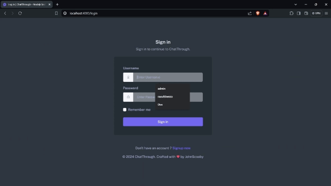
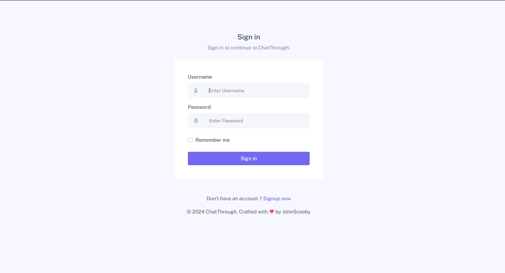
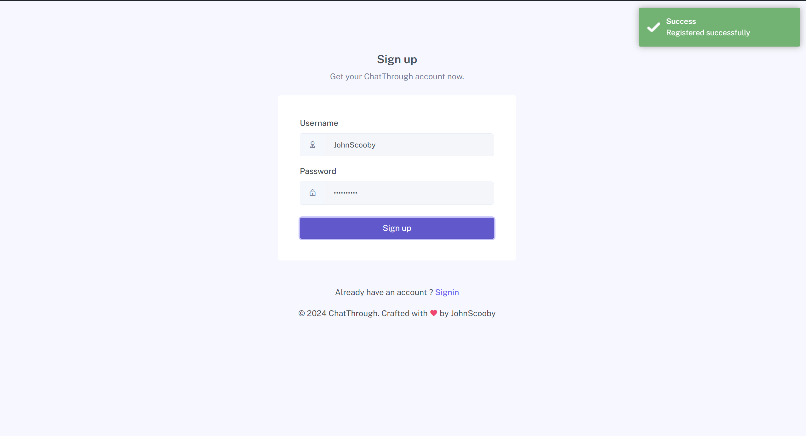
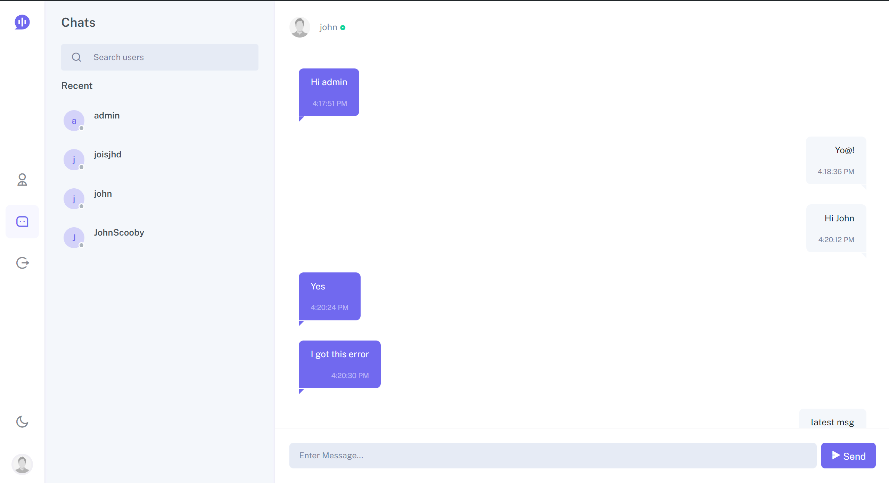
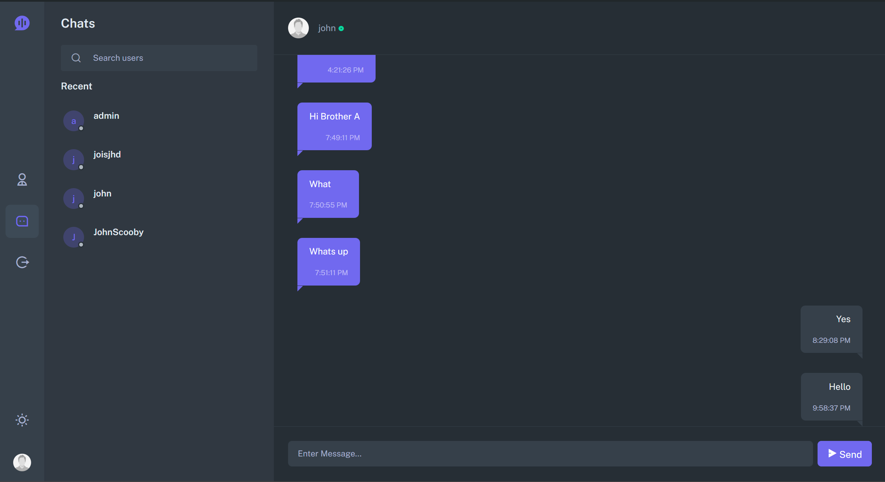
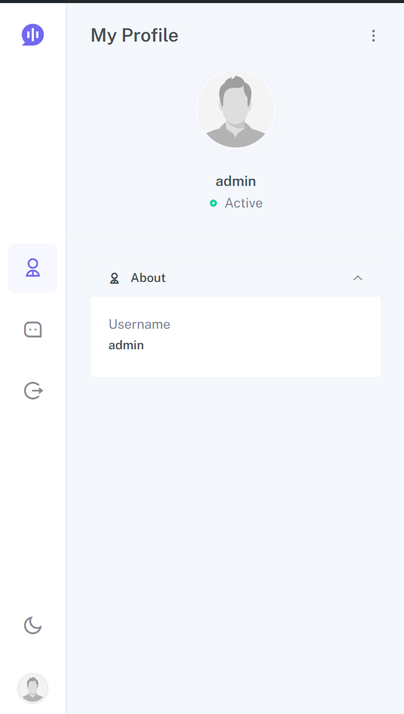

# ChatThrough - Real-time Chat Application

ChatThrough is a real-time chat application built using Node.js, Express, Socket.io, PostgreSQL (pg), and Astro DB (Cassandra).

## Tech Stack

- **Backend**
  - Node.js
  - Express
  - Socket.io for real-time communication
  
- **Databases**
  - PostgreSQL (pg) for relational data 
  - Astro DB (Cassandra) for NoSQL data storage 
  
- **Frontend**
  - HTML, CSS, JavaScript
  - jQuery for DOM manipulation

## Features

- Real-time messaging between users
- User authentication and authorization using JWT tokens
- PostgreSQL for storing relational data like user information.
- Astro DB (Cassandra) for storing chat messages.
- Responsive UI for seamless experience across devices.
- Automatic message rendering when reached the end for seamless user experience.

## Demo

For a high-quality demo, visit [here](https://github.com/VaishnavSherla/ChatThrough/raw/main/public/screenshots/ChatThrough.mp4).

## Screenshots

